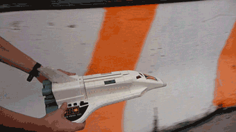

Some people get to live in outer space but it's unlikely to be you or me. There are a lot of people and not very many rockets, and if there were a lot of rockets there'd be no fuel to launch them.

I make uncrewed kites and balloons, study thin film polymer fabrication, and volunteer on the first DIY space suit. My hope is to advance long-duration wind and solar powered flight to the upper stratosphere to a point where I don't have to land.

Head Full of Air is a place to reimagine spacefaring futurity within reach, a personal space program to make near space living accessible.

I haven't flown yet. This might take a while.

**Under Construction**

expect more posts and galleries here soon.